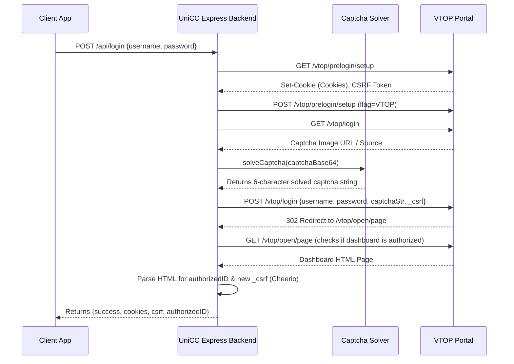

# UniCC Backend API & Scraping Documentation

This document provides a comprehensive reference for the UniCC (EZVTOP) backend API endpoints, details the VTOP / LMS / Vitol scraping flows, and explains the custom canvas-based neural network captcha solver.

---

## Table of Contents
1. [General Setup & Base URLs](#1-general-setup--base-urls)
2. [Authentication Flow & Captcha Solving](#2-authentication-flow--captcha-solving)
3. [Academics & Scraper Endpoints](#3-academics--scraper-endpoints)
4. [Hostel Management](#4-hostel-management)
5. [File Management & Mail Integration](#5-file-management--mail-integration)
6. [Web Push Notifications](#6-web-push-notifications)
7. [System & Analytics](#7-system--analytics)

---

## 1. General Setup & Base URLs

- **Local Development URL:** `http://localhost:3000`
- **Production API URL:** `https://api.uni-cc.site`
- **Standard Headers required for authenticated routes:**
  - `Content-Type: application/json`
  - Body includes user-session markers: `cookies`, `authorizedID`, and `csrf` (scraped from VTOP session).

---

## 2. Authentication Flow & Captcha Solving

VTOP authentication is a multi-step process handled programmatically by the backend.



### Captcha Solving Pipeline (`solveCaptcha`)
The scraper handles captchas automatically using an offline neural network classifier configured in [solveCaptcha.ts](file:///c:/Users/shyam/Music/projectvtop/UniCC-main/backend/src/routes/login/solveCaptcha.ts):
1. **Pre-processing:** The base64 captcha image is loaded into a virtual Canvas (`canvas` package).
2. **Segmentation (`getImageBlocks`):** Extracts pixel saturation values. The image is split into 6 character blocks of size $20 \times 23$ pixels based on fixed grid offsets:
   - $X_1 = (i+1) \times 25 + 2$
   - $Y_1 = 7 + 5 \times (i \pmod 2) + 1$
3. **Binarization (`binarizeImage`):** Each block is converted to binary format ($0$ or $1$) by comparing pixels against the average block pixel value.
4. **Classification:**
   - Flattens the binary matrix to a 1D vector.
   - Performs a matrix multiplication (`matMul`) with pre-trained weights (`bitmaps.weights`).
   - Adds pre-trained biases (`bitmaps.biases`).
   - Applies `softmax` to compute the character probabilities.
   - Decodes index to label string: `"ABCDEFGHJKLMNPQRSTUVWXYZ23456789"`.

---

## 3. Academics & Scraper Endpoints

All post-login academic endpoints require the following request body:
```json
{
  "cookies": "JSESSIONID=...; Path=/; HttpOnly",
  "authorizedID": "24BCE1234",
  "csrf": "a1b2c3d4-e5f6-...",
  "semesterId": "CH20242501" // (Optional for some endpoints)
}
```

### 3.1 Fetch Current Grades
- **Endpoint:** `POST /api/grades`
- **Target VTOP URLs:**
  - `/vtop/examinations/examGradeView/StudentGradeHistory`
  - `/vtop/processViewFeedBackStatus`
- **Scraping logic:**
  - Parses `#fixedTableContainer table` index `1` for effective course grades.
  - Parses table indexes `4` & `5` for credit-breakdown curriculum progress.
  - Extracts the CGPA list and counts (`S`, `A`, `B`, `C`, etc.) from `.table-hover.table-bordered`.
  - Scrapes the feedback status table to check if MidSem/EndSem student feedback is completed.

### 3.2 Fetch Attendance & Timetable
- **Endpoint:** `POST /api/attendance`
- **Target VTOP URLs:**
  - `/vtop/processViewStudentAttendance`
  - `/vtop/processViewTimeTable` (Timetable helper)
  - `/vtop/processViewAttendanceDetail` (Detailed Class attendance)
- **Scraping & Merging logic:**
  - Pulls overall attendance list from `#getStudentDetails table tbody tr`.
  - Merges it with the parsed timetable details. For every course match, it appends class IDs, credit counts, clean venues (e.g., `SJT-402`), and category tags.
  - Asynchronously hits `/vtop/processViewAttendanceDetail` with `classId` and `slotName` to extract a calendar array containing the status (`Present` / `Absent`) for every date class was held.

### 3.3 Fetch Examination Schedule
- **Endpoint:** `POST /api/schedule`
- **Target VTOP URL:** `/vtop/examinations/doSearchExamScheduleForStudent`
- **Scraping logic:**
  - Parses `table.customTable tr`.
  - Triggers on `colspan="13"` headers to dynamically group schedules under exam types (e.g. `FAT`, `CAT-1`, `CAT-2`).
  - Pulls details: `courseCode`, `courseTitle`, `slot`, `examDate`, `venue`, `seatLocation`, `seatNo`.

### 3.4 Academic Calendar
- **Endpoint:** `POST /api/calendar`
- **Target VTOP URL:** `/vtop/processViewCalendar`
- **Scraping logic:**
  - Runs parallel requests for all months belonging to the selected semester block (grouped into 5 or 3 month arrays based on semester ID suffix: `01` - Fall, `05` - Winter, `07` - Summer).
  - Parses `table.calendar-table td.day.hasevent` cells.
  - Matches styles/colors to categorize days as `Instructional Day`, `Holiday`, or `Other`.

### 3.5 Complete Multi-Semester Grade History
- **Endpoint:** `POST /api/all-grades`
- **Target VTOP URLs:**
  - `/vtop/examinations/examGradeView/doStudentGradeView`
  - `/vtop/examinations/examGradeView/getGradeViewDetails`
- **Scraping logic:**
  - Automatically calculates start academic year based on `authorizedID` matriculation prefix (e.g., `24BCE1234` starts at year `2024`).
  - Iterates through semesters (`CH<Year><NextYear>01`, `CH<Year><NextYear>07`, `CH<Year><NextYear>05`) until current date.
  - For each semester table, scrapes individual grade details, range limits (e.g., threshold for `S` grade), and absolute marks breakdown (`Mark Title`, `Max Mark`, `Weightage`, `Scored Mark`).

### 3.6 LMS / Moodle Scraper
- **Endpoint:** `POST /api/lms-data`
- **Target LMS URL:** `/login/index.php` (LMS Deno/Moodle instance)
- **Scraping logic:**
  - Logs in using credentials, gets session `sesskey`.
  - Pulls current monthly calendar block. Extracts elements matching `td.day.hasevent [data-region="event-item"] a`.
  - Fetches details for each event ID link. Scrapes breadcrumbs for Course Code / Name, due dates, submission completion status, and parses section headers to identify instructors.

### 3.7 Vitol Test Scraper
- **Endpoint:** `POST /api/vitol-data`
- **Target Vitol URL:** `/login/index.php` for target site client subdomains (e.g., `vitolcc.vit.ac.in`).
- **Scraping logic:**
  - Analogous to LMS Scraper. Scrapes quiz events, parsing the quiz page for strings matching `"Finished"` in the quiz attempt summary to mark test completion.

---

## 4. Hostel Management

- **Endpoint:** `POST /api/hostel`
- **Target VTOP URLs:**
  - `/vtop/studentsRecord/StudentProfileAllView` (Profile checks)
  - `/vtop/hostels/student/leave/1` (Initial Leave Setup)
  - `/vtop/hostels/student/leave/4` (Applied Leaves Status)
  - `/vtop/hostels/student/leave/6` (Historical Leaves list)
- **Scraping logic:**
  - Profile parse yields room assignment, warden contact info, gender, mess selection (`VEG`, `NON VEG`, `FOOD PARK`).
  - Merges list maps of `#LeaveHistoryTable` and `#LeaveAppliedTable` rows to create a distinct history of active and historical hostel leaves.

---

## 5. File Management & Mail Integration

Enables students to save academic files locally. Uses AWS S3 for storage.

| Method | Endpoint | Description |
|---|---|---|
| `POST` | `/api/files/upload/:userID` | Uploads academic file to S3 bucket. Metadata is stored in database. |
| `GET` | `/api/files/fetch/:userID` | Lists all files matching User ID. |
| `GET` | `/api/files/download/:userID/:fileID` | Fetches signed S3 download URL / streams file. |
| `DELETE` | `/api/files/delete/:userID/:fileID` | Deves file from S3 bucket and database. |
| `POST` | `/api/files/mail/send` | Emails files to user (uses `nodemailer`). |

---

## 6. Web Push Notifications

Uses standard Web Push Protocol (`web-push` library) to send updates regarding assignments, deadlines, or test alerts.

- **`POST /api/notifications/subscribe`**
  - Body: `{ subscription: PushSubscription, userID: string }`
  - Saves device push parameters to user document.
- **`POST /api/notifications/unsubscribe`**
  - Body: `{ endpoint: string, userID: string }`
- **`POST /api/notifications/config`**
  - Body: `{ userID: string, enabled: boolean, sources: { moodle: boolean, vitol: boolean } }`
  - Modifies notify filters (e.g. mute LMS, only notify Vitol).
- **`GET /api/notifications/status`**
  - Query: `?userID=...`
  - Returns boolean config state.
- **`POST /api/notifications/test`**
  - Triggers test payload push to verified device.

---

## 7. System & Analytics

- **`GET /api/status`**
  - Returns server health status. Increments unique visitor logs.
- **`GET /stats`**
  - Secure dashboard stats route. Returns API load metrics, total users, active notification counters, and background cron schedules logs.
